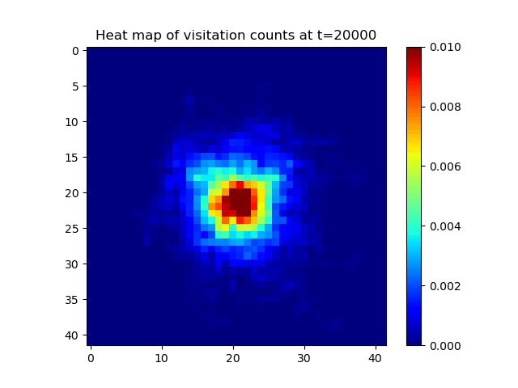

# Artificial_curiosity
Repository for my Master thesis on artificial curiosity.

In this project I investigated the benefits of shaping intrinsic rewards using a contrastively learnt abstract space.
______________________________________________________________________

###**_Abstract:_**

_Reinforcement learning algorithms are quite sensitive to the structure of the presented reward signal. Sparse and deceptive signals can cause an agent to fail to thoroughly explore the state space for better policies. The aim of intrinsic motivation is to provide a self-supervised reward function that incentivizes the agent to seek novel regions of the environment. However, common approaches based on prediction error (PE) can produce reward signals with unattractive properties for the learning progress of the agent. This investigation proposes a formalism that bridges the definition of novelty under the count-based setting with the generalizability provided by PE-based approaches. This formalism is extended to high-dimensional spaces, where abstract representations are necessary to reduce input complexity. Controlled experiments on simple grid worlds indicate that structuring the abstract space under a contrastive loss approximates the conditions proposed by the formalism. Further experiments on visually complex environments show that the proposed approach achieves results on par with well established encoders in the literature._

______________________________________________________________________

###**_Example results:_**

The following is how random local exploration behaves. It never manages to explore very far...

This is how my approach explores in the feature space:

And this is how the approach explores in an abstract (lower-dimensional) space:

####Quite mesmerizing, right? :)
